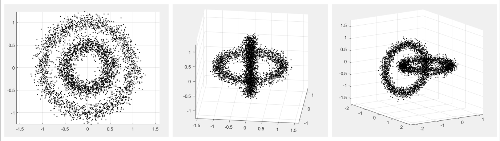

# Semi-supervised-and-Constrained-Clustering

MATLAB and Python code for semi-supervised learning and constrained clustering. It contains toy examples.

(Under construction.)

The repository contains the following files:

- `TestDataGeneration.m` This is an example that generates three data toy distributions and displays them in figures: a 2D doughnut, a 3D torus and a rod in the middle, and two interlocked tori. 



Functions `sampling_from_hypersphere` and `sampling_from_torus` are used to generate the toy data.


```
@misc{KunchevaSemiSupervisedConstrainedClustering2021,
author = {Ludmila I Kuncheva},
title = {Semi-supervised-and-Constrained-Clustering},
year = {2021},
publisher = {GitHub},
journal = {GitHub repository},
howpublished = {\url{https:\\github.com\LucyKuncheva\Semi-supervised-and-Constrained-Clustering }}
