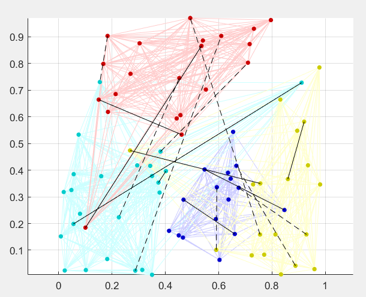
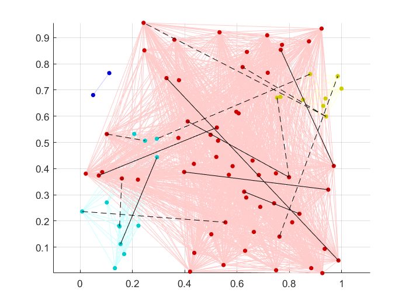

# Semi-supervised-and-Constrained-Clustering

MATLAB and Python code for semi-supervised learning and constrained clustering. It contains toy examples.

(Under construction.)

## Contents
The repository contains the following files:

- `TestDataGeneration.m` This is an example in MATLAB that generates three data toy distributions and displays them in figures: a 2D doughnut, a 3D torus and a rod in the middle, and two interlocked tori. 


Functions `sampling_from_hypersphere` and `sampling_from_torus` are used to generate the toy data.

`TestDataGeneration.py` is the same example in Python. It uses file `toy_data_generation.py` which contains the two respective functions. 

- `cop_kmeans.m` is MATLAB implementation of the COP-kmeans algorithm from [[1]](https://web.cse.msu.edu/~cse802/notes/ConstrainedKmeans.pdf).

```
function [labels, centres] = cop_kmeans(data, number_of_clusters, c_join, c_repel, maxIter, verbose)
%
% COP_KMEANS: Return the labels and centres of clusters applying must-link and cannot-link constraints. 
%
% data is a numerical array of size N(objects)-by-n(features)
% c_join is an nML-by-2 array containing the indices of the pairs that must be in the same cluster
% c_repel is an nCL-by-2 array containing the indices of the pairs that cannot be in the same cluster.
% maxIter is the limit number of iterations of the k-means algorithm
% verbose is a flag to allow plot of 2D data (if set to 1)
```

Without input arguments, the function runs a demo example. The output is a figure showing the clustering of 80 points in 2D into 4 clusters, with 8 must-link constraints and 8 cannot-link constraints. An example is shown below. Must-link constraints are shown with solid lines and cannot-link, with dashed lines.



- `constrained_hierarchical.m` is MATLAB implementation of the hierarchical (single linkage) constrained algorithm following [[2]](https://link.springer.com/content/pdf/10.1007/11564126_11.pdf)

```
function labels = constrained_hierarchical(data, number_of_clusters, c_join, c_repel, ~, verbose)
```
The inputs and the outputs are the same as in `cop_kmeans`. Without input arguments, the function runs a demo example. The output is a figure showing the clustering of 80 points in 2D into 4 clusters, with 8 must-link constraints and 8 cannot-link constraints.

An example is shown below. Must-link constraints are shown with solid lines and cannot-link, with dashed lines.




A testing script `Example_COP_kmeans.m` is included. It demonstrates cop-kmeans on the three toy data sets above.

`Example_COP_kmeans.py` is the same example in Python. It uses function `cop_kmeans.py`.

## References

[[1]. Wagstaff, K., Cardie, C., Rogers, S., & Schrödl, S., Constrained k-means clustering with background knowledge. In ICML, Vol. 1, 2001, pp. 577-584.](https://web.cse.msu.edu/~cse802/notes/ConstrainedKmeans.pdf)

[[2]. Davidson I. & Ravi, S.S, Agglomerative hierarchical clustering with constraints: Theoretical and empirical results, Proceedings of the 9th European Conference on Principles and Practice of Knowledge Discovery in Databases (PKDD), Porto, Portugal, October 3-7, 2005, LNAI 3721, Springer, 59-70.](https://link.springer.com/content/pdf/10.1007/11564126_11.pdf)

```
@misc{KunchevaSemiSupervisedConstrainedClustering2021,
author = {Ludmila I Kuncheva},
title = {Semi-supervised-and-Constrained-Clustering},
year = {2021},
publisher = {GitHub},
journal = {GitHub repository},
howpublished = {\url{https:\\github.com\LucyKuncheva\Semi-supervised-and-Constrained-Clustering }}
}
```
